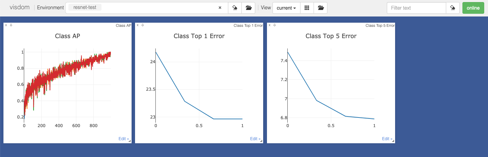

# DifficultyAwareEmbedding
A difficulty-aware embedding of complementary deep networks for image classification
It is the code released for [Embedding Complementary Deep Networks for Image Classification(CVPR2019)](http://openaccess.thecvf.com/content_CVPR_2019/papers/Chen_Embedding_Complementary_Deep_Networks_for_Image_Classification_CVPR_2019_paper.pdf).
<p align='center'>
    
</p>

## Citation 
If you find the paper or repository is useful, please kindly cite:
```
@InProceedings{Chen_2019_CVPR,
author = {Chen, Qiuyu and Zhang, Wei and Yu, Jun and Fan, Jianping},
title = {Embedding Complementary Deep Networks for Image Classification},
booktitle = {The IEEE Conference on Computer Vision and Pattern Recognition (CVPR)},
month = {June},
year = {2019}
}
```

## Setup/Prerequisite
* install the prerequisite python packages
```python
pip install -r requirements.txt
```

* Run the [Visdom](https://github.com/facebookresearch/visdom) server for monitoring the training/test process
```bash
visdom
```
<p align='center'>
    
</p>
<p align='center'>
    
</p>

## Training
1. Download the resnet50 pretrained model from official torchvision
```bash
wget -P checkpoints/test-resnet50 https://download.pytorch.org/models/resnet50-19c8e357.pth
```
2. Run the embedding algrithms for the following rounds
```bash
# for the second round
./scripts/trainval_resnet50.sh
```

## Test
1. Download the [resnet50 pretrained model](https://drive.google.com/open?id=16fs_iduFZvkyLVtmq7CUOyjQ7t9ZkNlG) and put it under checkpoints/resnet folder

2. Run the test script
```bash
./scripts/test_resnet50.sh
```